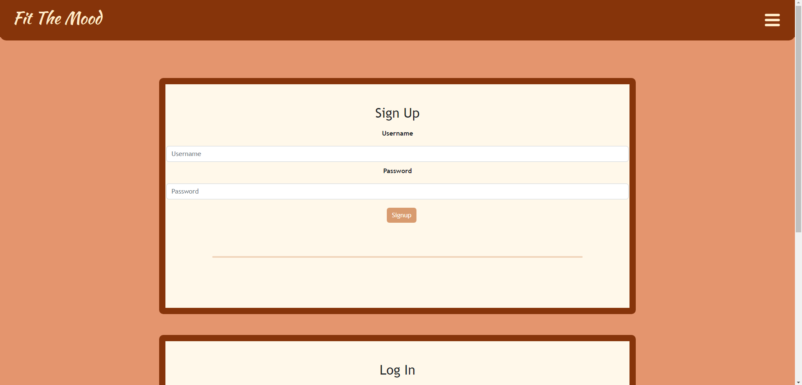
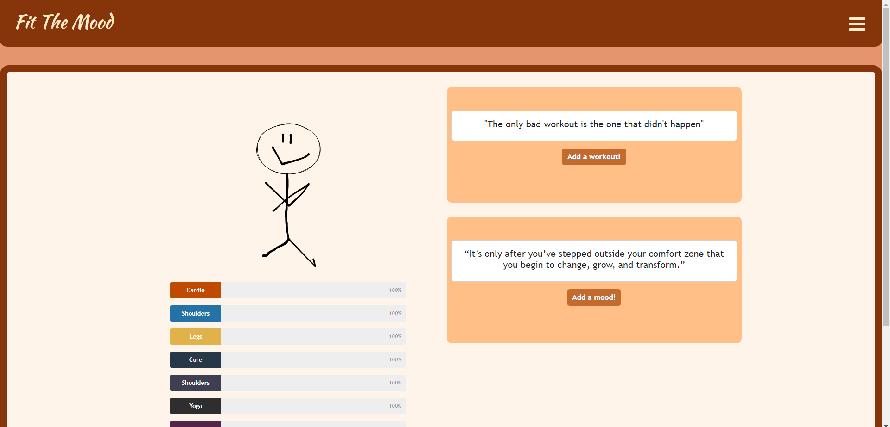
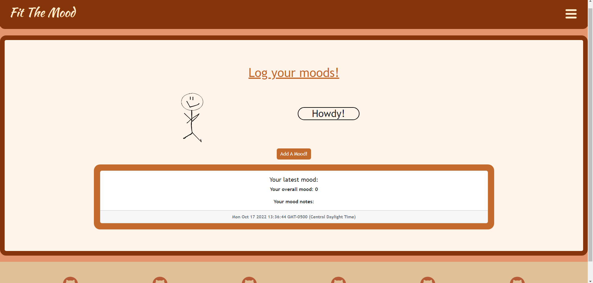
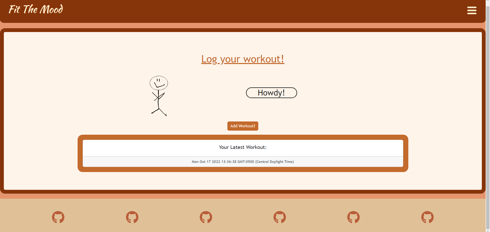

<!-- @format -->

<h1 align="center"> Fit The Mood </h1>
  

  
    
      
        
          
            
  

## Description⭐

#### This application is a one-stop website that allows the user to keep track of their emotions and workouts over time. They can easily view their most recent logs for both and add new ones as they wish.As a group, we wanted to create an easy way for people to keep track of how their moods differ based on what they might be going through, the time of week, etc.

## Table of Contents 📖

---

- [Description](#description⭐)
- [Installation Instructions](#installation-instructions)
- [Screenshots](#screenshots💡)
- [License Info](#license-info)
- [Technology Used](#technology-used🔧)
- [Contribution Guidelines](#contribution-guidelines👩🏻‍💻)
- [Test Instructions](#test-instructions📝)
- [Collaborators](#collaborators)

## Installation Instructions

#### Open the link for the site

---

## Screenshots💡

---

## License Info

#### This project is has no license.

---

## Technology Used🔧

#### This project used CSS, JavaScript, Node.js, React, Express.js, MongoDB.

---

## Contribution Guidelines👩🏻‍💻

#### Please contact us.

---

## Collaborators

#### Reach out to us!

#### Emails

<a href="mailto: zachary.feltman@gmail.com">Email: zachary.feltman@gmail.com</a>

<a href="mailto: gillespiekamary@gmail.com">Email: gillespiekamary@gmail.com</a>

<a href="mailto: halliemestas@gmail.com">Email: halliemestas@gmail.com</a>

<a href="mailto: martin.connere@gmail.com">Email: martin.connere@gmail.com</a>

<a href="mailto: tonymsanto@gmail.com">Email: tonymsanto@gmail.com</a>

<a href="mailto: sktmh007@gmail.com">Email: sktmh007@gmail.com</a>

---

#### Githubs

<a href='https://github.com/ZacharyFeltman'>Github: Zachary Feltman</a>

<a href='https://github.com/kamarygillespie4'>Github: Kamary Gillespie</a>

<a href='https://github.com/halliemestas'>Github: Hallie Mestas</a>

<a href='https://github.com/ConnerMart'>Github: Conner Martin</a>

<a href='https://github.com/Tonymsanto'>Github: Anthony Santo</a>

<a href='https://github.com/SThevenot'>Github: Sarah Thevenot</a>
